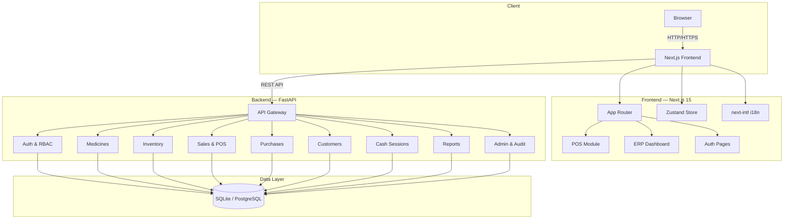

<div align="center">


# Pharmacy ERP & POS System

**A modern, open-source Pharmacy ERP & Point of Sale system built for independent pharmacies, chains, and hospitals.**

*Full Arabic (RTL) & English support · Designed for the Gulf/MENA market*

[](LICENSE)
[](https://github.com/omersx/pharmacy-erp/actions/workflows/ci.yml)
[](https://hub.docker.com/u/omersx)
[](https://www.npmjs.com/package/pharmacy-erp)
[](https://python.org)
[](https://nodejs.org)
[](https://fastapi.tiangolo.com)
[](https://nextjs.org)
[](CONTRIBUTING.md)

[Features](#-features) · [Quick Start](#-quick-start) · [Screenshots](#-screenshots) · [Architecture](#-architecture) · [API Docs](#-api-documentation) · [Docker](#-docker-deployment) · [Contributing](#-contributing)

</div>

---

## ✨ Features

<table>
<tr>
<td width="50%">

### 🏪 Point of Sale
- Fullscreen, keyboard-first, touch-friendly POS
- Barcode/search product lookup
- Hold & recall sales
- Split payments (cash, card, credit)
- Receipt printing (PDF export)

</td>
<td width="50%">

### 💊 Medicine Management
- Complete product catalog with categories
- Batch tracking with expiry dates
- FEFO (First Expiry, First Out) allocation
- CSV/Excel bulk import
- Low stock & expiry alerts

</td>
</tr>
<tr>
<td width="50%">

### 📦 Inventory & Purchasing
- Append-only inventory ledger
- Real-time stock levels per branch
- Purchase orders & goods receipt
- Supplier management & tracking
- Automated stock alerts

</td>
<td width="50%">

### 💰 Sales & Cash Management
- Sales invoices & returns
- Cash session management (open/close)
- Opening float & blind close
- X-Report & Z-Report generation
- Customer credit tracking

</td>
</tr>
<tr>
<td width="50%">

### 📊 Reports & Analytics
- Sales reports (daily, weekly, monthly)
- Inventory valuation reports
- Profit & margin analysis
- Top-selling products
- Exportable to Excel/PDF

</td>
<td width="50%">

### 🌍 Enterprise Features
- **Bilingual**: Full Arabic (RTL) + English
- **Dark/Light Theme**: Premium UI design
- **RBAC**: Role-based access control
- **Multi-branch**: Branch management
- **Responsive**: Desktop, tablet, & mobile

</td>
</tr>
</table>

---

## 📸 Screenshots

> **Coming soon** — Screenshots of the Dashboard, POS, Inventory, and Reports pages will be added here.
>
> Want to see the app in action? Follow the [Quick Start](#-quick-start) guide to run it locally in under 5 minutes!

<!-- Uncomment and add your screenshots:
<div align="center">

| Dashboard | Point of Sale |
|:---------:|:------------:|
|  |  |

| Inventory | Reports |
|:---------:|:-------:|
|  |  |

</div>
-->

---

## 🚀 Quick Start

### Prerequisites

| Tool | Version | Download |
|------|---------|----------|
| **Node.js** | 18+ | [nodejs.org](https://nodejs.org) |
| **pnpm** | 9+ | `npm install -g pnpm` |
| **Python** | 3.12+ | [python.org](https://python.org) |

### Option A: One-Command Setup

<details>
<summary><b>🪟 Windows</b></summary>

```batch
git clone https://github.com/omersx/pharmacy-erp.git
cd pharmacy-erp
start.bat
```

This will automatically:
1. Create the `.env` config file
2. Install all frontend & backend dependencies
3. Seed the database with demo data
4. Start both servers

</details>

<details>
<summary><b>🐧 Linux / 🍎 macOS</b></summary>

```bash
git clone https://github.com/omersx/pharmacy-erp.git
cd pharmacy-erp
chmod +x start.sh
./start.sh
```

</details>

### Option B: Step-by-Step

```bash
# 1. Clone the repository
git clone https://github.com/omersx/pharmacy-erp.git
cd pharmacy-erp

# 2. Install root dependencies (concurrently)
pnpm install

# 3. Setup frontend
pnpm run setup:frontend

# 4. Setup backend (auto-detects Windows/Linux/macOS)
pnpm run setup:backend

# 5. Configure environment
cp .env.example .env   # Linux/macOS
# copy .env.example .env  # Windows

# 6. Seed demo data
pnpm run seed

# 7. Start development servers
pnpm dev
```

### 🎉 You're Ready!

| Service | URL |
|---------|-----|
| 🌐 **Frontend** | [http://localhost:3000](http://localhost:3000) |
| 🔧 **Backend API** | [http://localhost:8000](http://localhost:8000) |
| 📚 **API Docs (Swagger)** | [http://localhost:8000/docs](http://localhost:8000/docs) |

### Default Login

| Role | Email | Password |
|------|-------|----------|
| Super Admin | `admin@pharmacy.com` | `admin123` |

> ⚠️ **Change the default credentials** before deploying to production!

---

## 🏗️ Architecture



### Project Structure

```
pharmacy-erp/
├── frontend/                 # Next.js 15 (App Router)
│   ├── src/
│   │   ├── app/              # Routes & pages
│   │   │   └── [locale]/     # i18n routing (en, ar)
│   │   │       ├── (app)/    # ERP dashboard pages
│   │   │       ├── (auth)/   # Login / register
│   │   │       └── (pos)/    # Point of Sale
│   │   ├── components/       # Reusable UI components
│   │   │   ├── ui/           # Base components (Radix UI)
│   │   │   └── pos/          # POS-specific components
│   │   ├── lib/              # API client, utilities
│   │   ├── store/            # Zustand state stores
│   │   ├── messages/         # i18n translations (en.json, ar.json)
│   │   └── i18n/             # i18n configuration
│   ├── Dockerfile
│   └── package.json
│
├── backend/                  # FastAPI (Python 3.12)
│   ├── app/
│   │   ├── core/             # Config, database, security, exceptions
│   │   ├── modules/          # Business logic modules
│   │   │   ├── auth/         # Authentication & JWT
│   │   │   ├── users/        # User management
│   │   │   ├── roles/        # RBAC roles & permissions
│   │   │   ├── organizations/# Branch management
│   │   │   ├── medicines/    # Product catalog & batches
│   │   │   ├── inventory/    # Stock movements & ledger
│   │   │   ├── sales/        # Invoices, returns, held sales
│   │   │   ├── purchases/    # Purchase orders
│   │   │   ├── suppliers/    # Supplier management
│   │   │   ├── customers/    # Customer & credit management
│   │   │   ├── cash_sessions/# Cash register sessions
│   │   │   ├── reports/      # Analytics & reporting
│   │   │   ├── notifications/# System notifications
│   │   │   └── admin/        # Audit logs & admin tools
│   │   ├── main.py           # FastAPI application entry
│   │   └── seed.py           # Demo data seeder
│   ├── Dockerfile
│   └── requirements.txt
│
├── nginx/                    # Nginx reverse proxy config
├── img/                      # Logo and brand assets
├── docker-compose.yml        # Production deployment
├── package.json              # Root orchestration scripts
├── start.bat                 # One-click setup (Windows)
├── start.sh                  # One-click setup (Linux/macOS)
├── .env.example              # Environment template
└── README.md
```

---

## 🖥️ Tech Stack

| Layer | Technologies |
|-------|-------------|
| **Frontend** | [Next.js 15](https://nextjs.org) · [React 19](https://react.dev) · [TypeScript](https://typescriptlang.org) · [Tailwind CSS](https://tailwindcss.com) |
| **UI Components** | [Radix UI](https://radix-ui.com) · [Lucide Icons](https://lucide.dev) · [Framer Motion](https://framer.com/motion) · [Recharts](https://recharts.org) |
| **State & i18n** | [Zustand](https://zustand-demo.pmnd.rs) · [next-intl](https://next-intl-docs.vercel.app) |
| **Backend** | [FastAPI](https://fastapi.tiangolo.com) · [Python 3.12](https://python.org) · [Pydantic v2](https://docs.pydantic.dev) · [SQLAlchemy 2](https://sqlalchemy.org) |
| **Database** | [SQLite](https://sqlite.org) (dev) · [PostgreSQL](https://postgresql.org) (production) |
| **Auth** | JWT (httpOnly cookies) · [Argon2](https://github.com/P-H-C/phc-winner-argon2) password hashing |
| **DevOps** | [Docker](https://docker.com) · [Nginx](https://nginx.org) · [Uvicorn](https://uvicorn.org) |

---

## 📖 API Documentation

Once the backend is running, interactive API documentation is available at:

| Format | URL |
|--------|-----|
| **Swagger UI** | [http://localhost:8000/docs](http://localhost:8000/docs) |
| **ReDoc** | [http://localhost:8000/redoc](http://localhost:8000/redoc) |

### API Modules

| Endpoint Prefix | Module | Description |
|----------------|--------|-------------|
| `/api/v1/auth` | Authentication | Login, register, refresh tokens |
| `/api/v1/medicines` | Medicines | CRUD, batches, categories, import |
| `/api/v1/inventory` | Inventory | Stock movements, alerts, ledger |
| `/api/v1/sales` | Sales | Invoices, returns, held sales |
| `/api/v1/cash-sessions` | Cash Sessions | Open, close, X/Z reports |
| `/api/v1/customers` | Customers | Customer management, credit |
| `/api/v1/suppliers` | Suppliers | Supplier directory |
| `/api/v1/branches` | Branches | Multi-branch management |
| `/api/v1/reports` | Reports | Sales, inventory, profit analytics |
| `/api/v1/users` | Users | User management |
| `/api/v1/roles` | Roles | RBAC roles & permissions |
| `/api/v1/admin` | Admin | Audit logs, system admin |
| `/api/v1/notifications` | Notifications | System notifications |

---

## 🐳 Docker Deployment

### Quick Deploy (from Docker Hub)

```bash
# Pull pre-built images and start
docker compose up -d

# This starts:
#   - FastAPI backend  → port 8000
#   - Next.js frontend → port 3000
#   - Nginx proxy      → port 80
```

Or pull images individually:

```bash
docker pull omersx/pharmacy-erp-backend:latest
docker pull omersx/pharmacy-erp-frontend:latest
```

### Build from Source (for contributors)

```bash
docker compose -f docker-compose.dev.yml up --build
```

### Production Checklist

- [ ] Change `SECRET_KEY` to a strong random value (32+ characters)
- [ ] Change default admin credentials
- [ ] Set `APP_ENV=production` and `DEBUG=false`
- [ ] Switch database to PostgreSQL
- [ ] Configure proper `CORS_ORIGINS`
- [ ] Enable HTTPS via reverse proxy
- [ ] Set up automated backups

---

## ⚙️ Environment Variables

| Variable | Description | Default |
|----------|-------------|---------|
| `APP_NAME` | Application name | `Pharmacy ERP` |
| `APP_ENV` | Environment (`development` / `production`) | `development` |
| `DEBUG` | Enable debug mode | `true` |
| `DATABASE_URL` | Database connection string | `sqlite+aiosqlite:///./data/pharmacy.db` |
| `SECRET_KEY` | JWT signing key (change in production!) | `dev-secret-key-...` |
| `ACCESS_TOKEN_EXPIRE_MINUTES` | Access token TTL | `30` |
| `REFRESH_TOKEN_EXPIRE_DAYS` | Refresh token TTL | `7` |
| `CORS_ORIGINS` | Allowed CORS origins (comma-separated) | `http://localhost:3000` |
| `NEXT_PUBLIC_API_URL` | API URL for the frontend | `http://localhost:8000/api/v1` |
| `REDIS_URL` | Redis URL (optional, for production) | — |
| `UPLOAD_DIR` | File upload directory | `./data/uploads` |
| `MAX_UPLOAD_SIZE_MB` | Max upload file size | `10` |

See [`.env.example`](.env.example) for the full template.

---

## 🌍 Internationalization

Pharmacy ERP ships with complete support for:

| Language | Direction | Status |
|----------|-----------|--------|
| 🇬🇧 English | LTR (Left-to-Right) | ✅ Complete |
| 🇸🇦 العربية (Arabic) | RTL (Right-to-Left) | ✅ Complete |

Switch languages from any page — the entire UI, including layout direction, updates instantly.

**Adding a new language:**

1. Create a new translation file: `frontend/src/messages/<locale>.json`
2. Add the locale to `frontend/src/i18n/` configuration
3. All strings are externalized — no hardcoded text in components

---

## 🤝 Contributing

We love contributions! Whether it's fixing bugs, adding features, improving docs, or suggesting ideas — all contributions are welcome.

1. **Fork** the repository
2. **Create** a feature branch: `git checkout -b feature/amazing-feature`
3. **Commit** your changes: `git commit -m 'feat: add amazing feature'`
4. **Push** to the branch: `git push origin feature/amazing-feature`
5. **Open** a Pull Request

Please read our [Contributing Guide](CONTRIBUTING.md) and [Code of Conduct](CODE_OF_CONDUCT.md) before getting started.

---

## 🗺️ Roadmap

- [ ] 📱 Mobile app (React Native)
- [ ] 🔌 Barcode scanner hardware integration
- [ ] 📊 Advanced analytics dashboard
- [ ] 🏥 Insurance claims module
- [ ] 💳 Payment gateway integration
- [ ] 📧 Email notifications & alerts
- [ ] 🔄 Real-time sync across branches
- [ ] 📋 Prescription management
- [ ] 🧪 Lab integration module

Have a feature idea? [Open a feature request!](../../issues/new?template=feature_request.md)

---

## ⭐ Show Your Support

If this project helps you, give it a ⭐ on GitHub — it means a lot and helps others discover it!

---

## 📄 License

This project is licensed under the **MIT License** — see the [LICENSE](LICENSE) file for details.

---

<div align="center">

**Built with ❤️ for pharmacies everywhere**

[Report Bug](../../issues/new?template=bug_report.md) · [Request Feature](../../issues/new?template=feature_request.md) · [Contribute](CONTRIBUTING.md)

</div>
